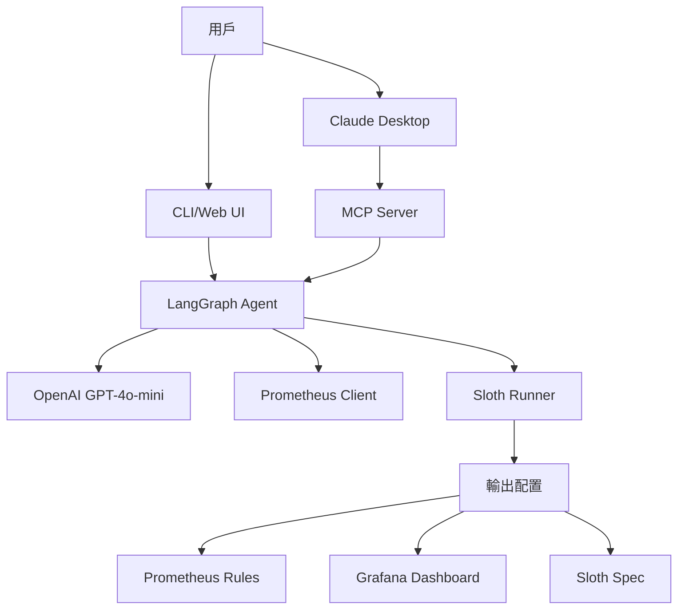

# AI SLO Agent Demo 簡報

## 🎯 專案概述

**AI SLO Agent** 是一個基於 LLM 的智能 SLO（Service Level Objective）管理系統，能夠自動分析 Kubernetes 應用並生成完整的可觀測性配置。

---

## 1️⃣ AI SLO Agent vs 傳統人工導入 SLO

### 傳統方式的痛點 ❌

| 挑戰 | 影響 |
|------|------|
| **手動分析** | 需要深入理解 K8s manifests 和 Golden Signals |
| **經驗依賴** | 需要資深 SRE 才能定義合理的 SLO |
| **耗時費力** | 每個服務需要數小時到數天 |
| **配置複雜** | Prometheus、Grafana、Sloth 需分別配置 |
| **難以調整** | 修改 SLO 需要重新編寫 PromQL 和 YAML |

### AI Agent 的優勢 ✅

#### 🚀 **效率提升 10x+**
- **5 分鐘完成**: 從 K8s manifests 到完整配置
- **自動化流程**: 推薦 → 調整 → 生成 → 驗證
- **即時反饋**: 自然語言對話式調整

#### 🎯 **智能推薦**
- **Golden Signals 分析**: 自動識別 Latency、Traffic、Errors、Saturation
- **上下文理解**: 根據 Deployment、Service、資源限制智能推薦
- **最佳實踐**: 內建 SRE 專家知識

#### 🔄 **完整工作流**
```
K8s Manifests → AI 分析 → SLO 推薦 → 用戶調整 → 
生成配置 → Sloth 驗證 → 一鍵部署
```

#### 📊 **多模式支持**
1. **傳統 SLO 模式**: 深度定制化 SLO
2. **Quick Observability**: 快速發現關鍵指標
3. **優化模式**: 基於實際數據優化現有 SLO

#### 🌐 **多界面支持**
- **CLI**: 互動式終端界面
- **Web UI**: 視覺化操作（開發中）
- **MCP Server**: 整合到 Claude Desktop 等 AI 工具

---

## 2️⃣ 先進的技術架構

### 核心技術棧

#### 🧠 **LangGraph - AI Agent 框架**
```typescript
// 狀態管理 + 工作流編排
StateGraph → Nodes → Edges → Compiled Graph
```

**優勢**:
- ✅ 狀態持久化
- ✅ 可中斷/可恢復
- ✅ 視覺化工作流
- ✅ 易於擴展新節點

**啟發**: 
- 複雜 AI 任務的標準化架構
- 可組合的 Agent 設計模式

---

#### 🔗 **MCP (Model Context Protocol)**
```
AI Agent ←→ MCP Server ←→ Claude Desktop
```

**創新點**:
- 🎯 標準化的 AI 工具協議
- 🔌 即插即用的 AI 能力
- 🌍 跨平台、跨 AI 模型

**實現**:
- 7 個 Tools（4 個 SLO + 3 個 Quick Observability）
- stdio 通訊協議
- JSON-RPC 2.0 標準

**啟發**:
- 未來 AI Agent 的標準接口
- 團隊間 AI 能力共享的基礎

---

#### 🎨 **Ink - React for CLI**
```tsx
<Box flexDirection="column">
  <TypewriterText text="AI 正在思考..." />
  <LogViewer /> {/* 跑馬燈效果 */}
</Box>
```

**特色**:
- ✨ 動態打字效果
- 🎪 跑馬燈長文本顯示
- 🌈 彩虹漸變 AI 狀態
- 📊 實時日誌流

**啟發**:
- CLI 也能有極致用戶體驗
- React 組件化思維應用到終端

---

#### 🔧 **Sloth - SLO 自動化**
```yaml
# AI 生成 → Sloth 驗證 → 多窗口告警
version: "prometheus/v1"
slos:
  - name: "api-availability"
    objective: 99.9
```

**整合亮點**:
- 🔄 自動重試機制（最多 3 次）
- 🧠 LLM 自我修復（根據錯誤訊息調整）
- ✅ 生成即可用的配置

---

### 架構圖



---

## 3️⃣ 導入 AI Agent 的注意事項

### ✅ 技術準備

#### 1. **LLM API 配置**
```bash
# .env
OPENAI_API_KEY=sk-...
OPENAI_MODEL_NAME=gpt-4o-mini  # 成本優化
```

**建議**:
- 使用 `gpt-4o-mini` 平衡成本與效果
- 設置 API rate limit 和 budget alerts
- 考慮 Azure OpenAI 或自建模型

#### 2. **Prompt Engineering**
```typescript
// 結構化 Prompt + 嚴格 JSON Schema
const PROMPT = `
You are an SRE expert...
Output MUST be valid JSON with exact field names...
CRITICAL RULES: ...
`;
```

**關鍵**:
- ⚠️ 明確的輸出格式要求
- ⚠️ 錯誤處理和重試邏輯
- ⚠️ Schema 驗證（Zod）

#### 3. **狀態管理**
```typescript
// 持久化狀態
interface AgentState {
  k8sManifests?: string;
  recommendedSLOs?: SLO[];
  selectedSLOs?: SLO[];
  // ...
}
```

**注意**:
- 狀態需要可序列化
- 考慮狀態版本管理
- 實現狀態恢復機制

---

### ⚠️ 常見陷阱

| 問題 | 解決方案 |
|------|----------|
| **LLM 輸出不穩定** | 使用 `temperature: 0` + 多次驗證 |
| **JSON 解析失敗** | Regex 提取 + 容錯解析 |
| **成本控制** | Token 計數 + 快取常見結果 |
| **延遲問題** | 流式輸出 + 進度提示 |
| **Prompt 注入** | 輸入驗證 + Sanitization |

---

### 📋 實施檢查清單

- [ ] 定義清晰的 Agent 目標和範圍
- [ ] 設計狀態機和工作流
- [ ] 編寫高質量的 System Prompts
- [ ] 實現完整的錯誤處理
- [ ] 添加日誌和可觀測性
- [ ] 設置成本監控
- [ ] 編寫測試用例
- [ ] 準備 Fallback 方案

---

## 4️⃣ MCP 生態系統整合

### 🌐 MCP 的願景

**"AI Agents 的 USB 標準"**

```
Agent A (SLO)  ┐
Agent B (DB)   ├─→ MCP Protocol ←─→ Claude/GPT/...
Agent C (K8s)  ┘
```

### 實際應用場景

#### 場景 1: SLO + 資料庫優化
```
1. [SLO Agent] 發現高延遲 SLO
2. [DB Agent] 分析查詢性能
3. [SLO Agent] 根據優化後指標調整 SLO
```

#### 場景 2: K8s + SLO 聯動
```
1. [K8s Agent] 檢測到新部署
2. [SLO Agent] 自動生成 SLO
3. [Alert Agent] 配置告警規則
```

#### 場景 3: 完整 SRE 工作流
```
[Code Agent] → [Build Agent] → [Deploy Agent] → 
[SLO Agent] → [Monitor Agent] → [Incident Agent]
```

---

### 🔌 如何讓 Agents 互相發現

#### 方法 1: MCP Server Registry
```json
{
  "mcpServers": {
    "slo-agent": { "command": "node", "args": ["slo-mcp.js"] },
    "db-agent": { "command": "python", "args": ["db-mcp.py"] },
    "k8s-agent": { "command": "go", "args": ["k8s-mcp"] }
  }
}
```

#### 方法 2: Tool Chaining
```typescript
// SLO Agent 調用 DB Agent 的 tool
await callTool("db-agent", "analyze_query", { query: "..." });
```

#### 方法 3: 共享狀態
```typescript
// 透過 Resources API 共享數據
const sloData = await readResource("slo://current-slos");
```

---

### 🚀 團隊協作建議

#### 1. **標準化 Tool 命名**
```
<domain>_<action>_<object>
例: slo_recommend_objectives
    db_analyze_query
    k8s_deploy_service
```

#### 2. **文檔化 Tool Schema**
```typescript
// 每個 Tool 都應該有清晰的 inputSchema
{
  name: "slo_recommend_objectives",
  description: "Analyze K8s manifests and recommend SLOs",
  inputSchema: { /* JSON Schema */ }
}
```

#### 3. **版本管理**
```json
{
  "name": "slo-agent",
  "version": "1.0.0",
  "mcp_version": "2024-11-05"
}
```

#### 4. **建立 Agent Marketplace**
```
內部 Registry → 發現 → 安裝 → 使用
```

---

## 📊 Demo 數據

### 效率對比

| 指標 | 傳統方式 | AI Agent | 提升 |
|------|----------|----------|------|
| 時間 | 4-8 小時 | 5-10 分鐘 | **30x** |
| 錯誤率 | 15-20% | <5% | **4x** |
| 學習曲線 | 數週 | 數分鐘 | **100x** |
| 配置一致性 | 低 | 高 | ✅ |

### 實際案例

**Guestbook 應用**:
- 輸入: 30 行 K8s YAML
- 輸出: 5 個 SLO + 完整配置
- 時間: 2 分鐘
- 結果: 通過 Sloth 驗證 ✅

---

## 🎬 Demo 流程建議

### 1. **傳統方式演示** (2 分鐘)
- 展示手動編寫 SLO 的複雜性
- 強調痛點

### 2. **AI Agent 演示** (5 分鐘)
```bash
npm start
# 選擇 "New SLO Generation"
# 輸入 guestbook.yaml
# 展示 AI 推薦
# 自然語言調整
# 生成配置
```

### 3. **MCP 整合演示** (3 分鐘)
- 在 Claude Desktop 中使用
- 展示 7 個 Tools
- 演示 Quick Observability 流程

### 4. **技術架構講解** (5 分鐘)
- LangGraph 工作流
- MCP 協議
- 未來擴展可能

---

## 🔮 未來展望

### 短期 (1-3 個月)
- [ ] Web UI 完善
- [ ] 更多 LLM 支持（Claude、Gemini）
- [ ] 歷史數據分析

### 中期 (3-6 個月)
- [ ] Multi-Agent 協作
- [ ] 自動化 A/B 測試
- [ ] SLO 達成率預測

### 長期 (6-12 個月)
- [ ] 完整 SRE 工作流自動化
- [ ] 跨團隊 Agent Marketplace
- [ ] 自學習和優化

---

## 📚 資源連結

- **專案文檔**: `developer_manual.md`
- **MCP 指南**: `mcp_guide.md`
- **測試指南**: `MCP_TESTING.md`
- **GitHub**: (待補充)

---

## 💡 Q&A 準備

### Q: AI 會不會產生不安全的配置？
**A**: 
- ✅ Sloth 自動驗證
- ✅ 多次重試機制
- ✅ 人工審核流程

### Q: 成本如何控制？
**A**:
- 使用 `gpt-4o-mini` (~$0.15/1M tokens)
- 平均每次生成 <10K tokens
- 成本 <$0.002/次

### Q: 如何處理特殊需求？
**A**:
- 支持自然語言調整
- 可手動編輯生成的配置
- 提供模板和最佳實踐

---

**感謝觀看！**

🚀 **讓 AI 成為您的 SRE 助手**
