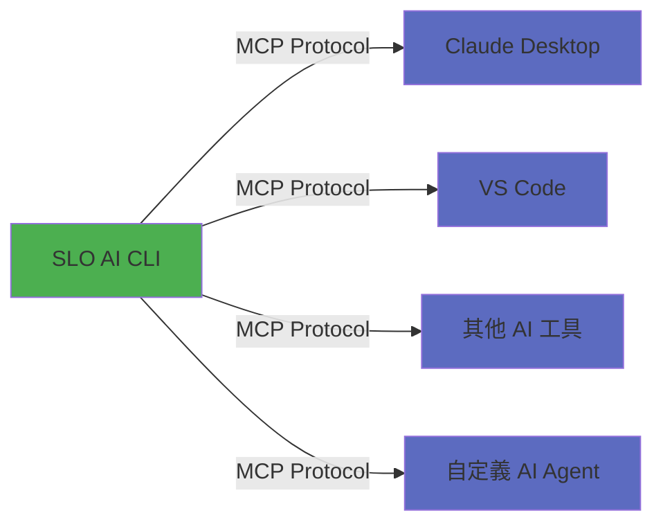
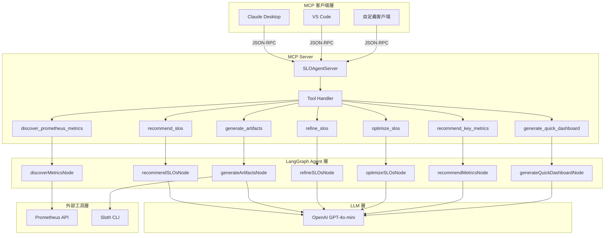
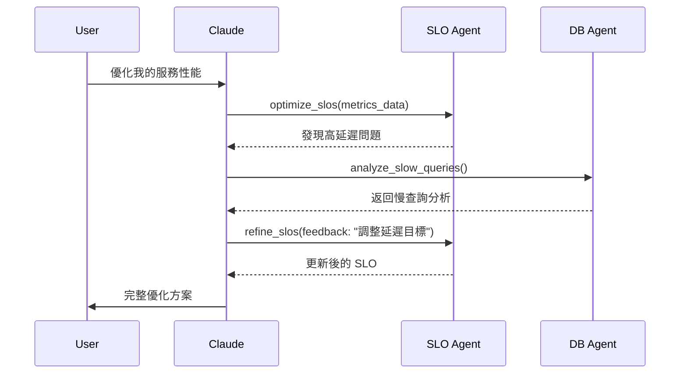

# SLO AI CLI - MCP 架構技術文件

## 📋 目錄

1. [概述](#概述)
2. [設計理念](#設計理念)
3. [架構概覽](#架構概覽)
4. [MCP Tools 詳細說明](#mcp-tools-詳細說明)
5. [技術實現細節](#技術實現細節)
6. [使用方法](#使用方法)
7. [最佳實踐](#最佳實踐)
8. [與其他 AI Agent 整合](#與其他-ai-agent-整合)

---

## 概述

**SLO AI CLI** 是一個基於 LLM 的智能 SLO (Service Level Objective) 管理系統,透過 **Model Context Protocol (MCP)** 將 AI Agent 能力標準化並開放給其他 AI 工具使用。

### 為什麼選擇 MCP?

MCP 是由 Anthropic 提出的標準化協議,旨在解決 AI Agent 之間互操作性的問題。它就像是 **「AI Agents 的 USB 標準」**,讓不同的 AI 工具能夠:

- 🔌 **即插即用**: 無需修改核心邏輯即可整合
- 🌍 **跨平台**: 支援 Claude Desktop、VS Code、任何支援 MCP 的客戶端
- 🔄 **可組合**: 多個 AI Agents 可以互相調用和協作
- 📦 **標準化**: 統一的 JSON-RPC 2.0 通訊協議

### 核心價值主張



---

## 設計理念

### 1. **單一職責原則 (Single Responsibility)**

每個 MCP Tool 專注於一個明確的任務:

- ✅ `recommend_slos` - 只負責分析和推薦
- ✅ `generate_artifacts` - 只負責生成配置
- ✅ `refine_slos` - 只負責調整優化

**優勢**: 易於測試、維護和組合

### 2. **無狀態設計 (Stateless)**

每次 Tool 調用都是獨立的,不依賴於伺服器端狀態:

```typescript
// ❌ 不好的設計 - 依賴伺服器狀態
class BadServer {
    private currentSLOs: SLO[] = []; // 狀態存在伺服器
}

// ✅ 好的設計 - 狀態由調用者管理
async function recommend_slos(manifests: string) {
    // 所有需要的資訊都在參數中
    return await recommendSLOsNode({ k8sManifests: manifests });
}
```

**優勢**: 可擴展、可並行、易於除錯

### 3. **Human-in-the-Loop (人機協作)**

AI 提供建議,人類做決策:

```
AI 推薦 SLOs → 人類審核選擇 → AI 生成配置 → 人類驗證部署
```

**優勢**: 平衡自動化效率與人類控制

### 4. **工作流分離 (Workflow Separation)**

提供兩種不同的工作流模式:

#### 傳統 SLO 工作流 (4 Tools)
```
K8s Manifests → recommend_slos → generate_artifacts → refine_slos → optimize_slos
```
適合: 深度定制化的 SLO 配置

#### Quick Observability 工作流 (3 Tools)
```
Prometheus → discover_metrics → recommend_key_metrics → generate_quick_dashboard
```
適合: 快速建立基礎可觀測性

---

## 架構概覽

### 整體架構圖



### 技術棧

| 層級 | 技術 | 用途 |
|------|------|------|
| **協議層** | MCP SDK (`@modelcontextprotocol/sdk`) | JSON-RPC 2.0 通訊 |
| **傳輸層** | stdio | 標準輸入/輸出通訊 |
| **Agent 層** | LangGraph (`@langchain/langgraph`) | 狀態管理與工作流編排 |
| **LLM 層** | OpenAI API (`@langchain/openai`) | 自然語言理解與生成 |
| **驗證層** | Zod | Schema 驗證 |
| **外部工具** | Sloth, Prometheus | SLO 驗證與指標查詢 |

### 資料流

```
1. MCP 客戶端發送 JSON-RPC 請求
   ↓
2. MCP Server 解析請求並路由到對應 Tool Handler
   ↓
3. Tool Handler 構建 Mock State 並調用 LangGraph Node
   ↓
4. LangGraph Node 調用 LLM (OpenAI) 進行分析/生成
   ↓
5. 結果經過驗證和格式化
   ↓
6. 透過 JSON-RPC 返回給客戶端
```

---

## MCP Tools 詳細說明

### 傳統 SLO 工作流

#### 1. `recommend_slos`

**用途**: 分析 Kubernetes manifests 並推薦 SLO

**輸入 Schema**:
```json
{
  "manifests": "string - K8s YAML 內容 (Deployment, Service 等)"
}
```

**輸出範例**:
```json
[
  {
    "name": "api-availability",
    "description": "API 可用性 SLO",
    "type": "availability",
    "target": 99.9,
    "window": "30d",
    "indicator": {
      "success_metric": "http_requests_total{status=~\"2..\"}",
      "total_metric": "http_requests_total"
    }
  }
]
```

**內部實現**:
- 調用 `recommendSLOsNode`
- 使用 LLM 分析 K8s manifests
- 識別 Golden Signals (Latency, Traffic, Errors, Saturation)
- 根據資源類型推薦合適的 SLO

**使用場景**:
```
用戶: "請分析這個 guestbook 應用的 K8s manifests"
AI: 調用 recommend_slos → 返回 5-8 個推薦的 SLO
```

---

#### 2. `generate_artifacts`

**用途**: 從 SLO 列表生成 Prometheus Rules、Grafana Dashboard 和 Sloth Spec

**輸入 Schema**:
```json
{
  "slos": "string - JSON 字串,包含 SLO 陣列"
}
```

**輸出範例**:
```json
{
  "prometheus_rules": "# Prometheus Rules YAML...",
  "grafana_dashboard": "{ \"dashboard\": {...} }",
  "sloth_spec": "version: prometheus/v1\nslos: [...]"
}
```

**內部實現**:
- 調用 `generateArtifactsNode`
- 使用 LLM 生成三種配置格式
- 透過 Sloth CLI 驗證配置正確性
- 自動重試機制 (最多 3 次)

**使用場景**:
```
用戶: "請為這些 SLO 生成配置"
AI: 調用 generate_artifacts → 返回可直接部署的配置
```

---

#### 3. `refine_slos`

**用途**: 根據自然語言反饋調整 SLO

**輸入 Schema**:
```json
{
  "current_slos": "string - 當前 SLO 的 JSON 字串",
  "feedback": "string - 自然語言指令,如 '移除所有流量相關的 SLO'"
}
```

**輸出範例**:
```json
[
  {
    "name": "api-latency",
    "target": 95.0,
    "window": "7d"
  }
]
```

**內部實現**:
- 調用 `refineSLOsNode`
- LLM 理解自然語言指令
- 智能調整 SLO 列表

**使用場景**:
```
用戶: "把所有 SLO 的目標從 99.9% 降到 99%"
AI: 調用 refine_slos → 返回調整後的 SLO
```

---

#### 4. `optimize_slos`

**用途**: 基於實際指標數據優化 SLO

**輸入 Schema**:
```json
{
  "metrics_data": "string - 指標數據或性能描述",
  "current_slos": "string - 可選,當前 SLO 配置"
}
```

**輸出範例**:
```text
## SLO 優化建議

### 當前狀況分析
- Error Budget 剩餘: 45%
- Burn Rate: 1.2x (正常)

### 優化建議
1. api-latency SLO 可以提高到 99.5%
2. 建議增加 P95 延遲監控
```

**內部實現**:
- 調用 `optimizeSLOsNode`
- 分析 Burn Rate 和 Error Budget
- 提供優化建議

**使用場景**:
```
用戶: "根據過去 7 天的數據優化 SLO"
AI: 調用 optimize_slos → 返回優化報告
```

---

### Quick Observability 工作流

#### 5. `discover_prometheus_metrics`

**用途**: 從 Prometheus 發現現有指標

**輸入 Schema**:
```json
{
  "app_name": "string - 應用名稱",
  "namespace": "string - K8s namespace",
  "prometheus_url": "string - 可選,Prometheus URL (未提供則使用 Mock)"
}
```

**輸出範例**:
```json
{
  "discoveredMetrics": [
    "http_requests_total",
    "http_request_duration_seconds",
    "process_cpu_seconds_total",
    "process_resident_memory_bytes"
  ]
}
```

**內部實現**:
- 調用 `discoverMetricsNode`
- 查詢 Prometheus API (或使用 Mock 數據)
- 過濾與應用相關的指標

---

#### 6. `recommend_key_metrics`

**用途**: 根據觀測目標推薦關鍵指標

**輸入 Schema**:
```json
{
  "discovered_metrics": "string - JSON 陣列,已發現的指標",
  "observability_goal": "string - 觀測目標,如 'latency and errors'"
}
```

**輸出範例**:
```json
{
  "recommendedMetrics": [
    {
      "name": "http_request_duration_seconds",
      "type": "histogram",
      "description": "HTTP 請求延遲",
      "reason": "符合延遲監控目標"
    }
  ]
}
```

**內部實現**:
- 調用 `recommendMetricsNode`
- LLM 理解觀測目標
- 從已發現指標中選擇 3-4 個關鍵指標

---

#### 7. `generate_quick_dashboard`

**用途**: 快速生成 Grafana Dashboard

**輸入 Schema**:
```json
{
  "recommended_metrics": "string - JSON 字串,推薦的指標",
  "app_name": "string - 應用名稱",
  "namespace": "string - K8s namespace"
}
```

**輸出範例**:
```json
{
  "dashboard": {
    "title": "Guestbook Quick Dashboard",
    "panels": [...]
  }
}
```

**內部實現**:
- 調用 `generateQuickDashboardNode`
- 生成 Grafana Dashboard JSON
- 自動配置 Panel 和 Query

---

## 技術實現細節

### MCP Server 核心實現

```typescript
class SLOAgentServer {
    private server: Server;

    constructor() {
        this.server = new Server(
            {
                name: "slo-ai-agent",
                version: "1.0.0",
            },
            {
                capabilities: {
                    tools: {},
                },
            }
        );

        this.setupToolHandlers();
    }

    private setupToolHandlers() {
        // 1. 註冊 Tools 列表
        this.server.setRequestHandler(ListToolsRequestSchema, async () => {
            return {
                tools: [
                    {
                        name: "recommend_slos",
                        description: "...",
                        inputSchema: { /* JSON Schema */ }
                    },
                    // ... 其他 6 個 tools
                ]
            };
        });

        // 2. 處理 Tool 調用
        this.server.setRequestHandler(CallToolRequestSchema, async (request) => {
            switch (request.params.name) {
                case "recommend_slos": {
                    const manifests = String(request.params.arguments?.manifests);
                    const mockState = { k8sManifests: manifests };
                    const result = await recommendSLOsNode(mockState);
                    return {
                        content: [{
                            type: "text",
                            text: JSON.stringify(result.recommendedSLOs, null, 2)
                        }]
                    };
                }
                // ... 其他 cases
            }
        });
    }

    async run() {
        const transport = new StdioServerTransport();
        await this.server.connect(transport);
    }
}
```

### 關鍵設計決策

#### 1. **Mock State Pattern**

每個 Tool 調用都創建一個臨時的 Mock State:

```typescript
// 為什麼使用 Mock State?
// - LangGraph Nodes 需要完整的 AgentState
// - MCP 調用是無狀態的
// - Mock State 橋接兩者

const mockState: any = {
    k8sManifests: manifests,
    recommendedSLOs: [],
    // ... 只包含該 Node 需要的欄位
};

const result = await recommendSLOsNode(mockState);
```

#### 2. **JSON 字串傳遞複雜物件**

```typescript
// 為什麼使用 JSON 字串而非直接傳遞物件?
// - MCP inputSchema 只支援基本類型
// - 確保跨語言相容性
// - 明確的序列化/反序列化邊界

inputSchema: {
    properties: {
        slos: {
            type: "string", // 而非 "array"
            description: "JSON string representing an array of SLO objects."
        }
    }
}
```

#### 3. **錯誤處理策略**

```typescript
try {
    // 執行 Tool 邏輯
} catch (error: any) {
    console.error("Error executing tool:", error);
    return {
        content: [{
            type: "text",
            text: `Error: ${error.message}`
        }],
        isError: true // MCP 標準錯誤標記
    };
}
```

### 通訊協議細節

#### JSON-RPC 2.0 請求範例

```json
{
  "jsonrpc": "2.0",
  "id": 1,
  "method": "tools/call",
  "params": {
    "name": "recommend_slos",
    "arguments": {
      "manifests": "apiVersion: apps/v1\nkind: Deployment\n..."
    }
  }
}
```

#### JSON-RPC 2.0 響應範例

```json
{
  "jsonrpc": "2.0",
  "id": 1,
  "result": {
    "content": [
      {
        "type": "text",
        "text": "[{\"name\": \"api-availability\", ...}]"
      }
    ]
  }
}
```

---

## 使用方法

### 方法 1: Claude Desktop 整合

#### 配置步驟

1. **編譯專案**
```bash
cd /Users/isosoman/Documents/SLO_AI\ CLI
npm run build
```

2. **配置 Claude Desktop**

編輯 `~/Library/Application Support/Claude/claude_desktop_config.json`:

```json
{
  "mcpServers": {
    "slo-ai-agent": {
      "command": "node",
      "args": ["/Users/isosoman/Documents/SLO_AI CLI/dist/mcp_server.js"]
    }
  }
}
```

3. **重啟 Claude Desktop**

4. **使用範例**

```
用戶: 請使用 recommend_slos 工具分析這個 K8s manifest:
[貼上 YAML 內容]

Claude: [調用 recommend_slos tool]
根據分析,我推薦以下 5 個 SLO...
```

---

### 方法 2: MCP Inspector 測試

```bash
# 安裝 MCP Inspector
npm install -g @modelcontextprotocol/inspector

# 啟動測試
npm run build
mcp-inspector node dist/mcp_server.js
```

開啟瀏覽器,可以:
- 查看所有 7 個 Tools
- 測試每個 Tool 的調用
- 查看請求/響應詳情

---

### 方法 3: 自定義 MCP 客戶端

```javascript
import { Client } from '@modelcontextprotocol/sdk/client/index.js';
import { StdioClientTransport } from '@modelcontextprotocol/sdk/client/stdio.js';

const transport = new StdioClientTransport({
    command: 'node',
    args: ['dist/mcp_server.js']
});

const client = new Client({
    name: 'my-client',
    version: '1.0.0'
}, {
    capabilities: {}
});

await client.connect(transport);

// 列出所有 Tools
const tools = await client.request({
    method: 'tools/list'
}, ListToolsResultSchema);

// 調用 Tool
const result = await client.request({
    method: 'tools/call',
    params: {
        name: 'recommend_slos',
        arguments: {
            manifests: '...'
        }
    }
}, CallToolResultSchema);
```

---

## 最佳實踐

### 1. **輸入驗證**

```typescript
// ✅ 好的做法
let slos: SLO[] = [];
try {
    slos = JSON.parse(slosJson);
} catch (e) {
    throw new McpError(ErrorCode.InvalidParams, "Invalid JSON for 'slos'");
}

// ❌ 不好的做法
const slos = JSON.parse(slosJson); // 可能拋出未處理的異常
```

### 2. **錯誤訊息清晰**

```typescript
// ✅ 提供有用的錯誤訊息
throw new McpError(
    ErrorCode.InvalidParams,
    "Invalid JSON for 'slos'. Expected array of SLO objects."
);

// ❌ 模糊的錯誤訊息
throw new Error("Invalid input");
```

### 3. **日誌記錄**

```typescript
// 使用 console.error 而非 console.log
// MCP 使用 stdout 通訊,日誌必須寫入 stderr
console.error("[MCP Server] Tool called:", toolName);
console.error("[MCP Server] Error:", error);
```

### 4. **版本管理**

```typescript
// 在 Server 配置中明確版本
new Server({
    name: "slo-ai-agent",
    version: "1.0.0", // 遵循 Semantic Versioning
}, { ... });
```

### 5. **Schema 文檔化**

```typescript
// 提供清晰的 description
{
    name: "recommend_slos",
    description: "Analyze Kubernetes manifests and recommend Service Level Objectives (SLOs).",
    inputSchema: {
        properties: {
            manifests: {
                type: "string",
                description: "The content of Kubernetes YAML manifests (Deployment, Service, etc.)"
            }
        }
    }
}
```

---

## 與其他 AI Agent 整合

### 場景 1: SLO + 資料庫優化 Agent



### 場景 2: K8s + SLO 自動化

```typescript
// K8s Agent 檢測到新部署
const deployment = await k8sAgent.getLatestDeployment();

// 自動調用 SLO Agent 生成 SLO
const slos = await sloAgent.callTool('recommend_slos', {
    manifests: deployment.yaml
});

// 自動生成配置
const artifacts = await sloAgent.callTool('generate_artifacts', {
    slos: JSON.stringify(slos)
});

// 自動部署到 Prometheus
await prometheusAgent.deploy(artifacts.prometheus_rules);
```

### 場景 3: 完整 SRE 工作流

```
[Code Review Agent] 
    ↓ (檢測到新服務)
[SLO Agent: recommend_slos]
    ↓ (生成 SLO)
[SLO Agent: generate_artifacts]
    ↓ (生成配置)
[Deploy Agent: 部署到 K8s]
    ↓ (監控運行)
[SLO Agent: optimize_slos]
    ↓ (持續優化)
[Alert Agent: 配置告警]
```

### Agent 發現機制

#### 方法 1: 共享 MCP Registry

```json
// ~/.mcp/registry.json
{
  "agents": {
    "slo-agent": {
      "command": "node",
      "args": ["path/to/slo-mcp.js"],
      "capabilities": ["slo_management", "observability"]
    },
    "db-agent": {
      "command": "python",
      "args": ["path/to/db-mcp.py"],
      "capabilities": ["database_optimization"]
    }
  }
}
```

#### 方法 2: Tool Naming Convention

```
<domain>_<action>_<object>

範例:
- slo_recommend_objectives
- slo_generate_artifacts
- db_analyze_query
- k8s_deploy_service
```

#### 方法 3: MCP Resources API (未來)

```typescript
// SLO Agent 發布資源
server.setResourceHandler('slo://current-slos', () => {
    return { slos: [...] };
});

// 其他 Agent 讀取
const sloData = await client.readResource('slo://current-slos');
```

---

## 總結

### 核心優勢

✅ **標準化**: 遵循 MCP 協議,與任何 MCP 客戶端相容  
✅ **模組化**: 7 個獨立 Tools,可單獨或組合使用  
✅ **無狀態**: 易於擴展和並行處理  
✅ **可組合**: 與其他 AI Agents 無縫整合  
✅ **類型安全**: 完整的 TypeScript 類型定義和 Schema 驗證  

### 技術亮點

- 🧠 **LangGraph** 提供強大的 Agent 工作流編排
- 🔗 **MCP** 實現標準化的 AI 工具協議
- 🎯 **Human-in-the-Loop** 平衡自動化與人類控制
- 🔄 **雙工作流** 支援深度定制和快速啟動兩種模式

### 未來展望

- [ ] 支援更多 LLM (Claude, Gemini)
- [ ] 實現 MCP Resources API
- [ ] Multi-Agent 協作範例
- [ ] Agent Marketplace 整合
- [ ] 實時 Streaming 支援

---

**讓 AI Agents 互相協作,共同構建更智能的 SRE 生態系統!** 🚀
